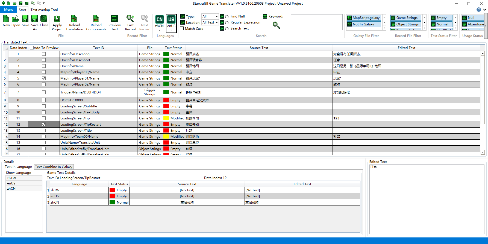
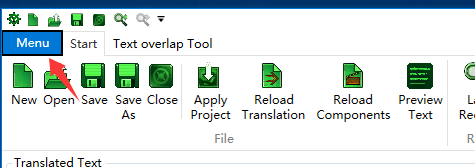
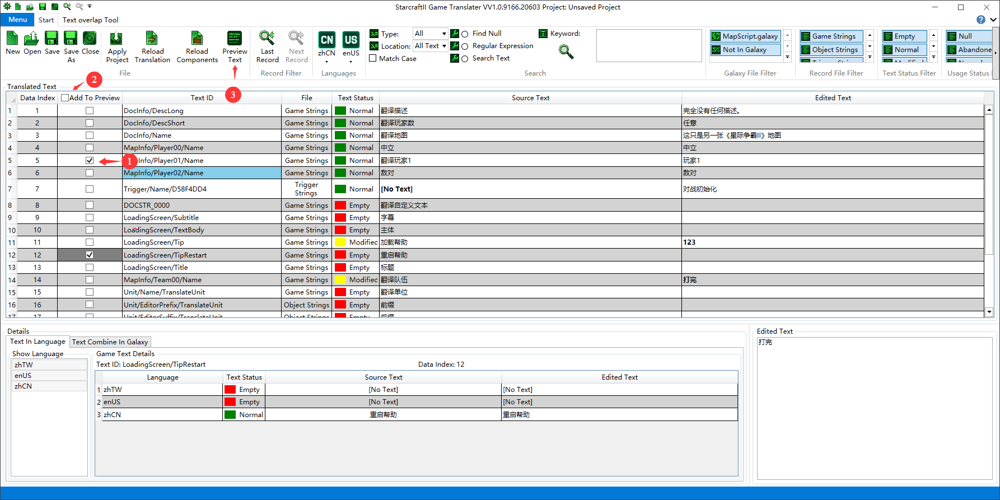
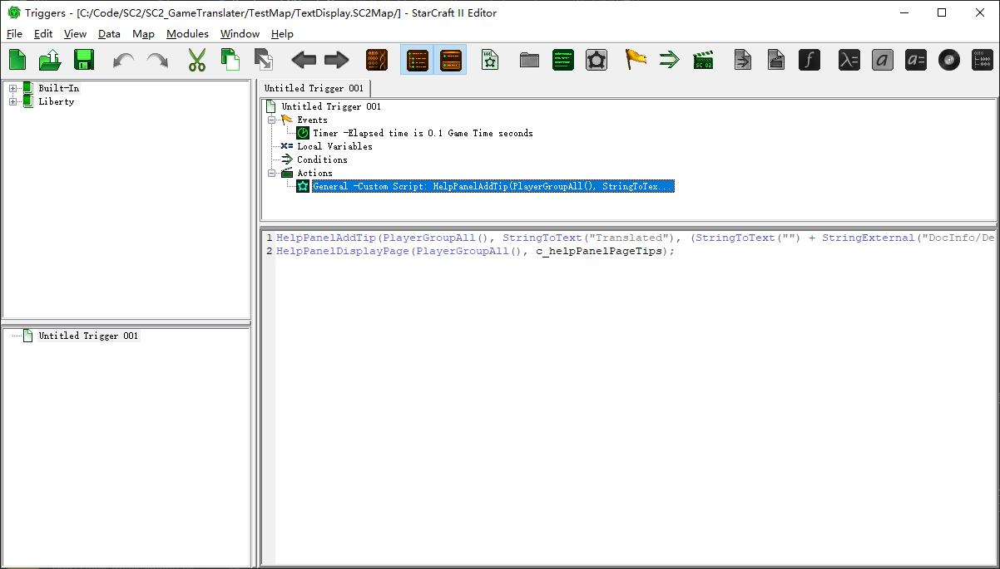
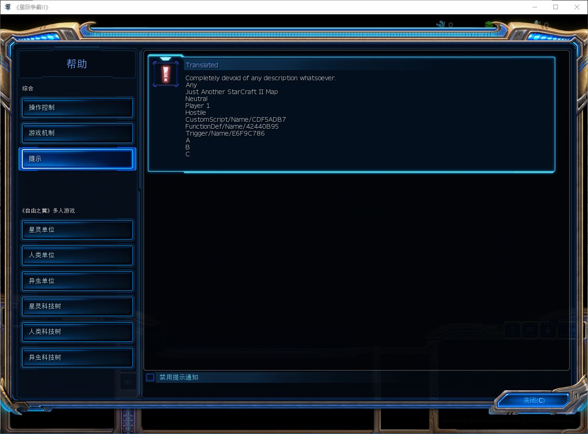
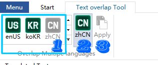

SC2_GameTranslater
=====================
Hi SC2 modders, I'm Whimsyduke form Team Froggy&Catty. SC2_GameTranslater is one of our open source projects for Starcraft II mod community. With this tool, Modders can translate your Map/Mod in to different local languages, we wish this tool can help you sharing your works and increasing communications between people all around the world. 

Based on our translate experience, we have developed utility kits such as auto backup, modification and text search/comparison to simplify and optimize the translation process. This tool also supports various functions such as collation, content filtration and in game preview. The translater can even finish the translation without complete mod or map files. So this tool can also be good partner of players and project cooperators.

How to use
=======

Before We Start
============

>If you first open this software and find there are so many Chinese words, don't be panic. Just follow the picture to find the language selection menu. Then all things will be familiar.

Toolbar
============

1.File
------------

New
--------

>Create a new translation project for SC2. The tool requires a map or mod that saved as SC2component folds. You can double click the ComponentList.SC2Components to open this mod/map. Using SC2component fold can increase the loading speed of your mod/map, once you apply your translation, the files will automatically save your translated text to local language folds like enUS.SC2Data.

Open
--------

>Open a saved project file. If you once saved your work, a SC2Gametran file will be created, it contains all necessary information that translation needed. So you can continue your work or share it with partners without the Map/mod files.

Save
--------

>Save your works to SC2Gametran file.

Save as
--------

>Save your works to a new SC2Gametran file.

Close
--------

>Shutdown the software.

Apply project
--------

>Send your translated text to the Mod/map (SC2component folds). It will modify the ingame text as well.

Reload Translation
--------

>Import translated text from another SC2Gametran file. It will also refresh your translated text. You can select one or more languages you need.

Reload Components
--------

>Import translated text from old version SC2Gametran file or Mod/map (SC2component folds). It won't change your text, instead, Abandoned text and usage status will be refreshed, you can compare these text with current text (source text and edited text) so that identify the changed text during the updates. (the Abandoned text and usage status are hide by default, you may need to set them by right click the table title of main translation zone.)

PreviewText
--------

>Generate a Galaxy script to preview the translation result. You can select the preview text by checking the corresponding checkbox in ① in the figure below (you can click the corresponding checkbox in ② to select or unselect the current filtered text, note that it will not change the status of the hidden rows due to the filtering mismatch, but the hidden text will not be added to the previewed text), and then click the corresponding button in ③ to generate the previewed Galaxy Script and add it to the Clipboard. Then add the generated Galaxy code to the custom script action of the map test trigger. Enable the map to preview the result.

2.Record Filter
--------------

Last Record/Next Record
------------

>After using the filter or search kits, the content in main translation zone will be changed. You can use this kit to shift between different statuses just like page up/down.

3.Language
-----------

>Select the languages that your reference and target of translation. Such as enUS to zhCN. You can modify and collate your text as well if you use same reference and target languages.

4.Search
-------------

>Search tool allow you to filter and find the contents you need. You can search base on different location, match case or Regular expression.

5.Filter
-------------

Galaxy File Filter
--------------

>Filter text from different galaxy files, such as LibLIB1, LibIB1h and so on.

Record File Filter
---------------

>Filter text from different record, such as data editor, trigger and so on.

Text Status Filter
--------------

>Filter text from different status, such as modified and unmodified and so on.

Usage Status Filter
--------------

>Filter text base on the usage status in the mod. Such as added, modified and abandoned. Requires using `Reload Components` first.

Text overlap tool
-------------

This tool can overlap the translated text to other local languages. Such as using enUS in frFR and deDE.

1.Target language
-----------

>Select one or more languages that you want overlap to.

2.Source language
-----------

>Select one language as the source language, make sure it's already translated.

3.Apply
-------------

>Apply the process then the target languages will be overwritten.

Main Translation Zone
==================

1.Data Index
-----------

>The unique index of the text.

2.Text ID
--------------

>The text ID in SC2 editor.

3.File
--------------

>The file that contains this text.

4.Text Status
------------

>Show the modify status of the text.

5.Usage Status
------------

>Show the usage status in the mod. Such as added, modified and abandoned. Requires using `Reload Components` first.

6.Abandoned Text
--------------

>The default abandoned text is same as the source text. If use the `Relaod Components` to load an old version mod, it will show the text of `old version mod` and can be used to compare with current text.

Detail View
==================

1.Show Language
-------------

>Show all languages that your mod used, it can be set in the SC2 editor, you can see in the picture, there are three activated languages in the example mod.

2.Game Text Details
------------------

>Show the text in all activated languages, notice that you can only preview the text here, this tool doesn't support modification.

3.Edited Text
---------------

>Same as the edited text frame in the main translation zone, but bigger and easier to read and write.

4.Text Combine in Galaxy
--------------------

>Show the text details in the galaxy script, if a sentence contains various strings in galaxy script, you can review the final result here too, such as `this weapon creates`+`points damages.`.

